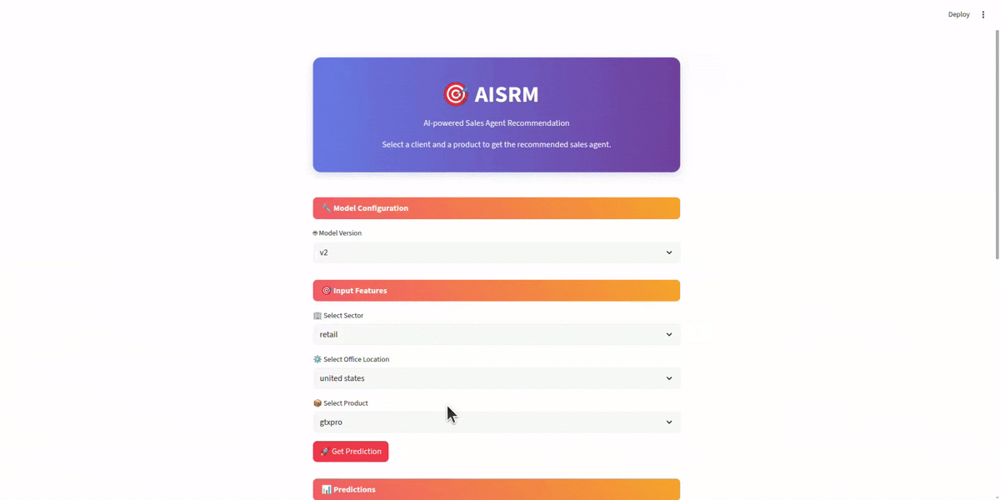

# AISRM - AI Sales Representative Matcher

## Welcome to AISRM

AISRM is an innovative AI-powered decision tool designed to accelerate the process of finding and matching the perfect sales representatives for specific business needs. By leveraging advanced machine learning algorithms and data analysis, our application takes the guesswork out of sales team optimization.

## Our Mission

In today's competitive business landscape, finding the right sales talent can make or break a company's success. Traditional methods often rely on intuition and limited data points, leading to costly mistakes and lengthy processes. AISRM addresses this challenge by harnessing the power of artificial intelligence to create data-driven matches between businesses and sales professionals.

Our mission is to streamline the decision-making process during presales by accelerating the benchmarking of sales agents. Our intelligent, efficient, and cost-effective solution benefits both managers seeking the best sales representatives for specific deals and sales agents looking for opportunities that align with their skills and expertise.

Finding the right sales talent is crucial for business success, but traditional selection methods can be time-consuming and ineffective. AISRM solves this challenge by:

- **Intelligent Matching**: Our AI analyzes sales representative performance metrics to identify the best candidates for your specific requirements

## Key Features

- 🤖 **AI-Powered Recommendations**: Advanced algorithms that learn from successful matches
- 📊 **Performance Analytics**: Detailed insights into sales representative capabilities and track records
- 🎯 **Precision Matching**: Customizable criteria to find representatives that align with your business requirements
- 📈 **Success Prediction**: Forecast potential performance based on historical data

## Get Started

Ready to transform your sales process? Try our app and discover how AI can help you build a winning sales team.